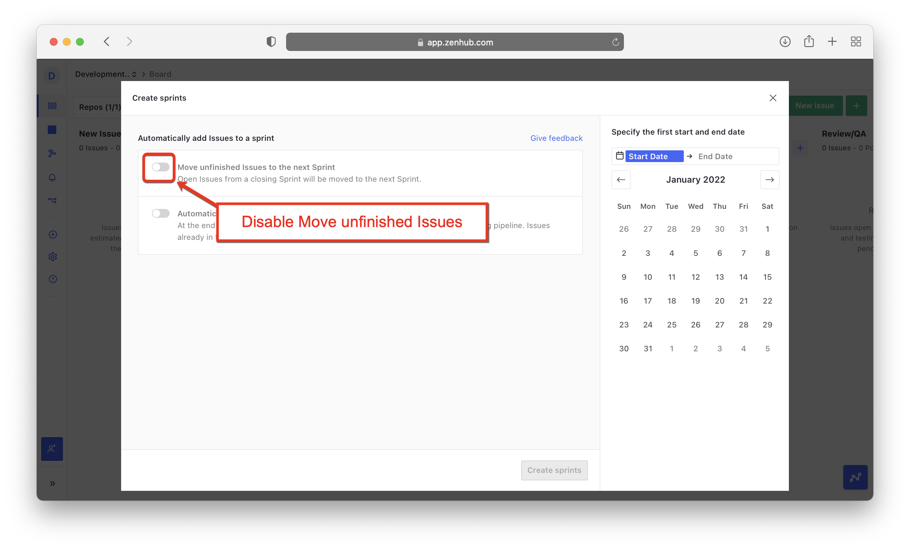
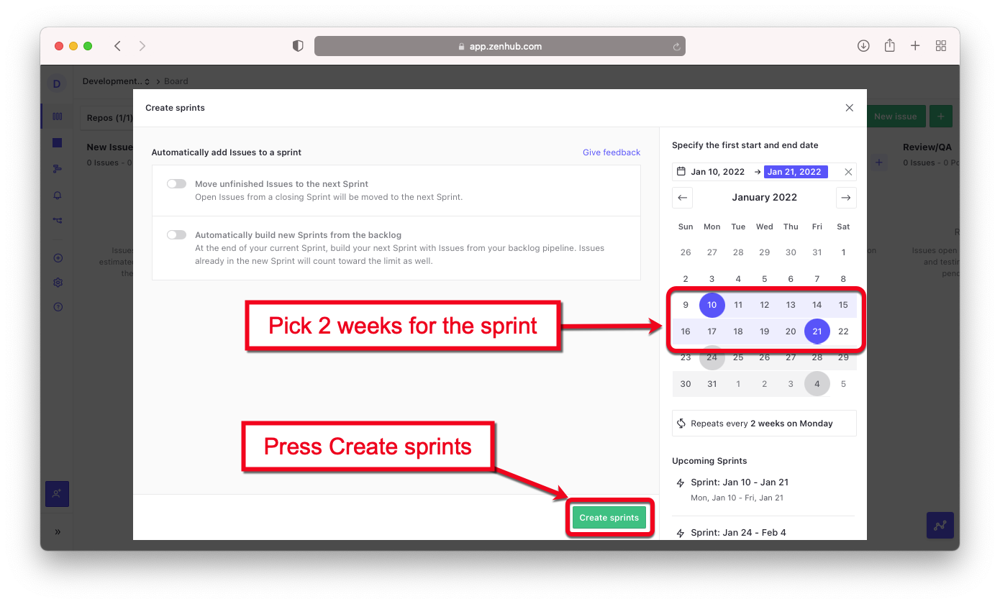
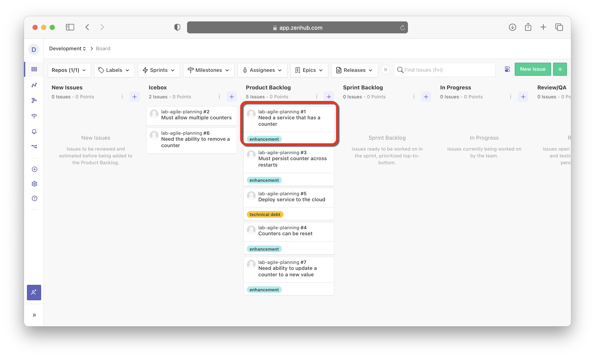
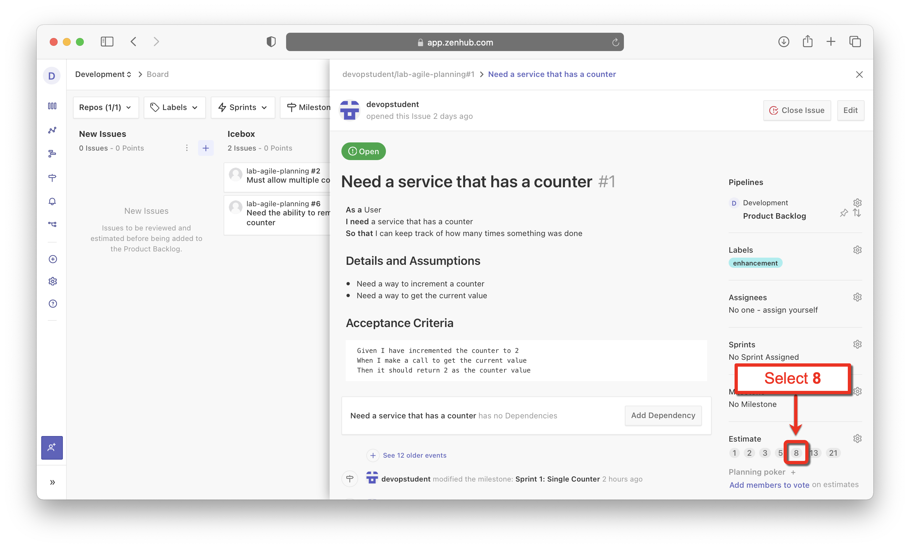
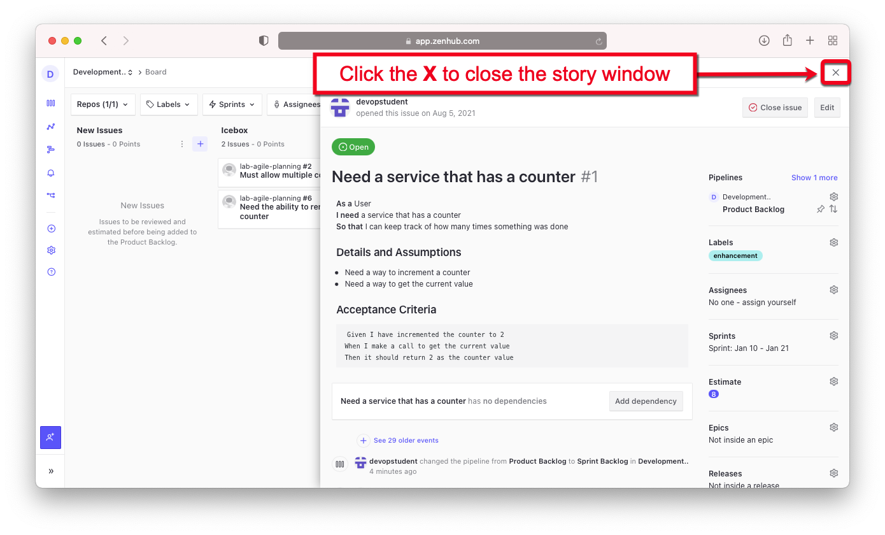
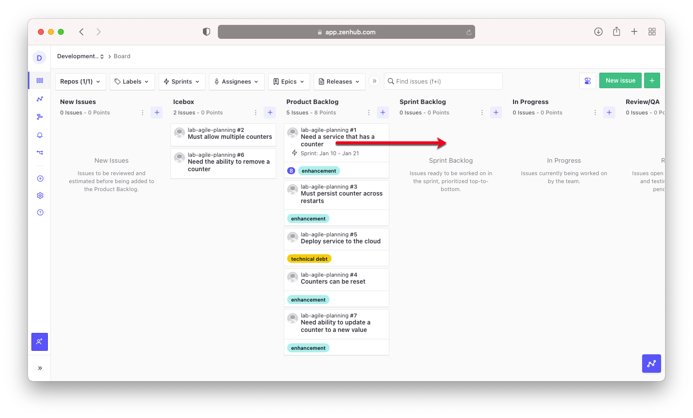
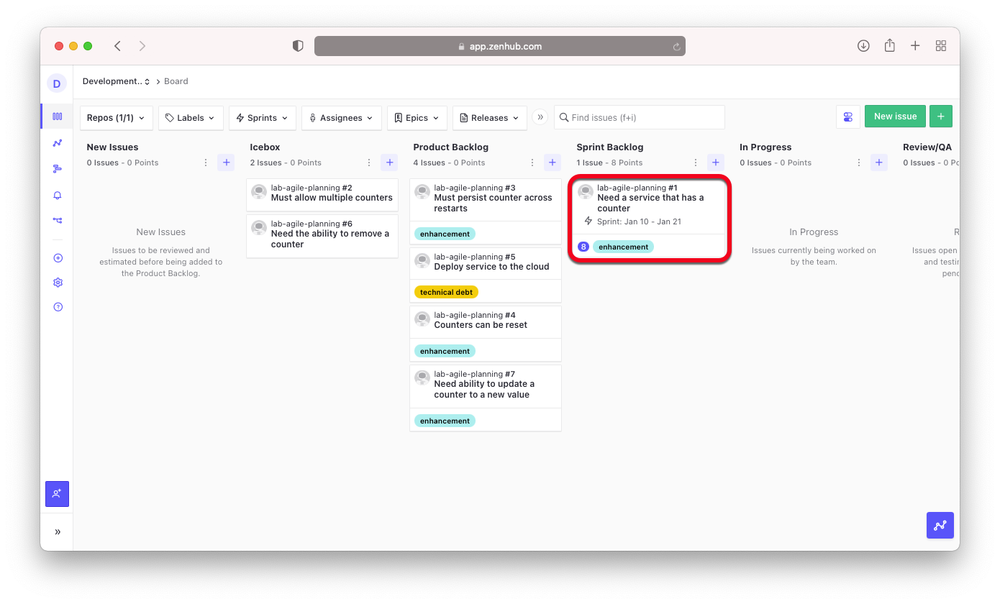
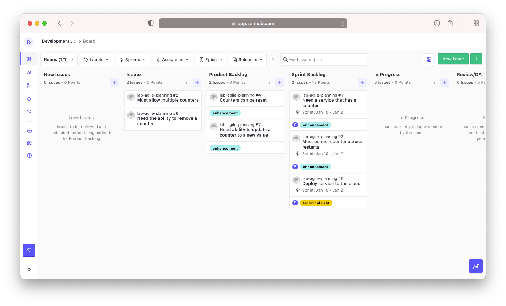
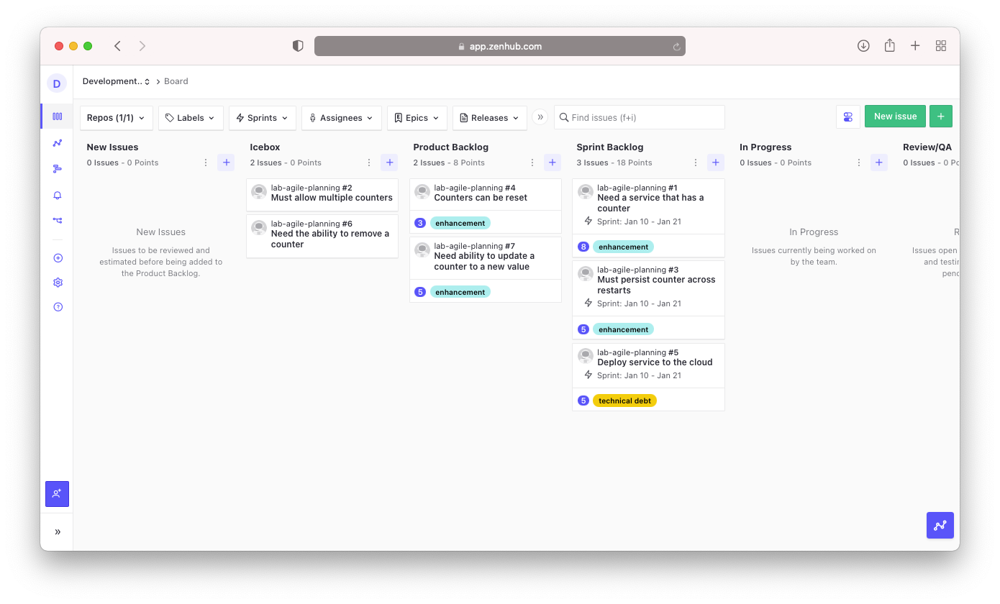

# Lab 5: Build the Sprint Plan from your Product Backlog

**Estimated time needed:** 10 minutes

In this lab, you will create a sprint plan from your product backlog. This is normally done during the sprint planning meeting with the entire team, so for this exercise we will have to simulate that meeting.

## Objectives

After completing this lab, you will be able to:

1. Set up sprints.
1. Assign estimates to stories.
1. Assign a sprint to stories.
1. Build your sprint backlog.

## Initial State

After completing the previous lab, your kanban board should look like this:

**New Issues:**

- None

**Icebox:**

- Must allow multiple counters
- Need the ability to remove a counter

**Product Backlog:**

- Need a service that has a counter
- Must persist counter across restarts
- Deploy service to the cloud
- Counters can be reset
- Need ability to update a counter to a new value

---

## Exercise 1 : Setup Sprints

In this exercise, you will setup your sprints. ZenHub will set up three (3) sprints by default to get you started. It wil then create new sprints for you as needed automatically.

1. Go to [app.zenhub.com](http://app.zenhub.com) and sign in with your GitHub account and bring up your kanban board.
    

1. Click the **+** icon and select **Set up Sprints for your team** from the dropdown menu.
    

1. In the window that pops up, disable the switch labeled "Move unfinished Issues to the next sprint". This type of automation breeds bad habits and is not very agile, which is why I suggest it be disabled. You should understand why Issues are unfinished and determine if they are still needed in the next sprint as priorities may have changed.
    

1. Pick a date range of 2 weeks for the sprint duration, where the current date that you are working on this lab is within that range. In this example we selected a Monday to the following Friday which is two weeks later. You will see this selection in blue. Notice that ZenHub hints that it will create two future sprints as well (in grey). Press the **Create sprints** button to create the sprints.
    

You now have a sprint that can be used for sprint planning in the next exercise.

---

## Exercise 2 : Create a Sprint Plan

In this exercise, you will create a sprint plan. We will assign estimated story points and a sprint, and move the stories from the **Product Backlog** into the **Sprint Backlog** to build our plan.

1. Select the top story *Need a service that has a counter* from the **Product Backlog** to open it.
    

2. You discussed the story with the team, and your developers agree that this is a large story worth **8** story points, so set the **Estimate** to **8**.
    

3. Click on the **Gear** icon next to **Sprints** and select the first sprint from the dropdown list to assign the story to that sprint. You may notice that you can assign a story to more than one sprint. This is not very agile! If your story is bigger than a sprint then it's too big and should be broken down into smaller "sprint-sized" stories.
    

4. Your story should look like the one below. Click the **X** to close the story window and get back to the kanban board.
    

5. The development team has determined that adding an 8 point story to the sprint is acceptable. Drag the story from the **Product Backlog** to the **Sprint Backlog**.
    

6. Your kanban board should now look like the one below. Notice that the story point estimate and sprint dates are annotations on the story.
    

7. The sprint planning meeting has proceeded nicely. In discussions with the development team, they have estimated the next two stories in the **Product Backlog** and determined that they can both fit in the current sprint. Select each of the following stories in the **Product Backlog**, assign them the corresponding story points and the same *Sprint*, and drag them to the **Sprint Backlog** in the same order.

    | Story Title | Story Points |
    |-------|-------|
    | Must persist counter across restarts | 5 |
    | Deploy service to the cloud | 5 |

    At the end of this step, your sprint plan should look like this:

    

8. Based on the teams velocity, the development team has decided there are enough stories in the sprint, but there is some time left in the sprint planning meeting to estimate more stories. Add the following estimates to the stories in the **Product Backlog**.

    | Story Title | Story Points |
    |-------|-------|
    | Counters can be reset | 3 |
    | Need ability to update a counter to new value | 5 |

At the end of this exercise, your kanban board should look like this:

## Summary

You learned how to set up your sprints. You also learned how to assign story points to stories, assign stories to a sprint, and assemble a sprint plan from your product backlog.
